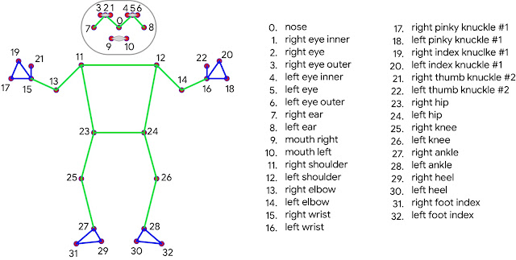
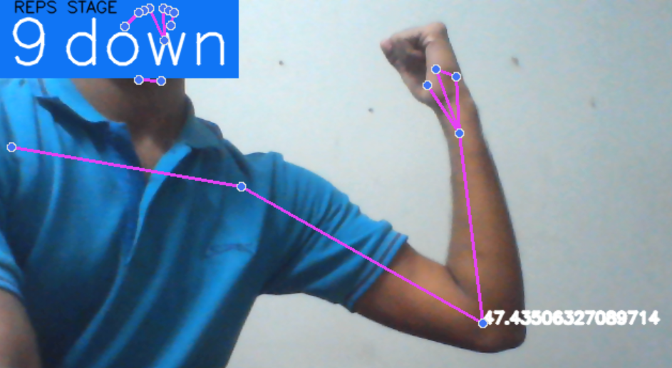

# Pose Estimator with Curl Counter

This project utilizes deep learning and the MediaPipe library's 'pose' model to estimate human poses in real-time. Additionally, it includes a curl counter feature that increments each time a dumbbell is lifted, providing a measure of the user's workout progress.

## Model

The pose model used in this project is based on the MediaPipe library. MediaPipe is an open-source framework developed by Google that provides a collection of pre-trained models and tools for building various computer vision and machine learning applications.

The 'pose' model in MediaPipe is designed for real-time human pose estimation. It aims to detect and track key body landmarks, such as the shoulders, elbows, wrists, hips, knees, and ankles, in a video stream or image. By analyzing the spatial relationships between these landmarks, the model can estimate the pose or the positioning of a person's body in the frame.

The landmark model in MediaPipe Pose predicted the location of 32 pose landmarks (see figure below).

## Features

- Real-time pose estimation using the MediaPipe 'pose' model.
- Detection and tracking of key body landmarks, such as the shoulders, elbows, and wrists.
- Calculation of angles and movements to determine if a curl (dumbbell lift) has been performed.
- Incrementing and display of a curl counter to track the number of curls completed during a workout session.

## Requirements

- Python 3.7 or above
- MediaPipe library
- OpenCV
- TensorFlow
- Numpy

## Results

The pose estimator with the curl counter feature has shown promising results in accurately detecting and tracking human poses in real-time while effectively counting the number of dumbbell curls performed. 

