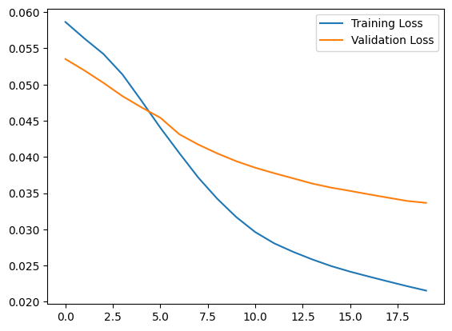
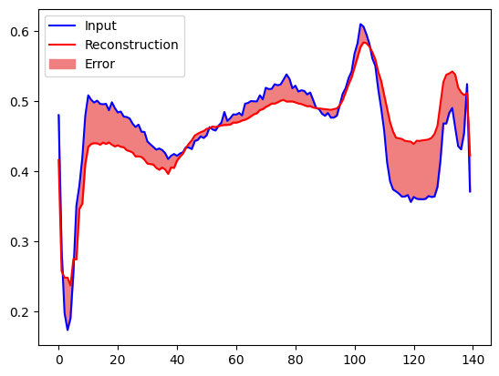
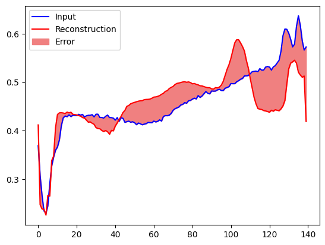

# Anomaly detection

## Overview

In this project, I will train an autoencoder to detect anomalies on the [ECG5000 dataset](http://www.timeseriesclassification.com/description.php?Dataset=ECG5000). This dataset contains 5,000 [Electrocardiograms](https://en.wikipedia.org/wiki/Electrocardiography), each with 140 data points. I will use a simplified version of the dataset, where each example has been labeled either `0` (corresponding to an abnormal rhythm), or `1` (corresponding to a normal rhythm). I am interested in identifying the abnormal rhythms.

## Approach

An autoencoder is trained to minimize reconstruction error. I will train an autoencoder on the normal rhythms only, then use it to reconstruct all the data. My hypothesis is that the abnormal rhythms will have higher reconstruction error. I will then classify a rhythm as an anomaly if the reconstruction error surpasses a fixed threshold.

## Training

I trained the autoencoder for 20 epochs. The results of training are as follows:

## Detecting Anamolies

I detected anomalies by calculating whether the reconstruction loss for input example during inference is greater than a fixed threshold. I calculated the mean average error for normal examples from the training set, then classified unseen examples as anomalous if the reconstruction error was higher than one standard deviation from the training set. Following is a comparison of the reconstruction loss for normal vs abnormal examples.

#### Normal

#### Abnormal

## Model Performance Metrics

Here are the performance metrics achieved by my abnormal ECG rhythm detection model:

- **Accuracy:** 0.943
- **Precision:** 0.99
- **Recall:** 0.90

These metrics provide a comprehensive evaluation of the model's effectiveness in identifying abnormal ECG rhythms. A high accuracy score indicates that the model is successful in correctly classifying ECG signals, while precision and recall values give insight into the model's ability to minimize false positives and capture true positives effectively. We can play with the fixed threshold value (of reconstruction loss) used for normal vs abnormal ecg detection, to alter the precision and recall of our model.
