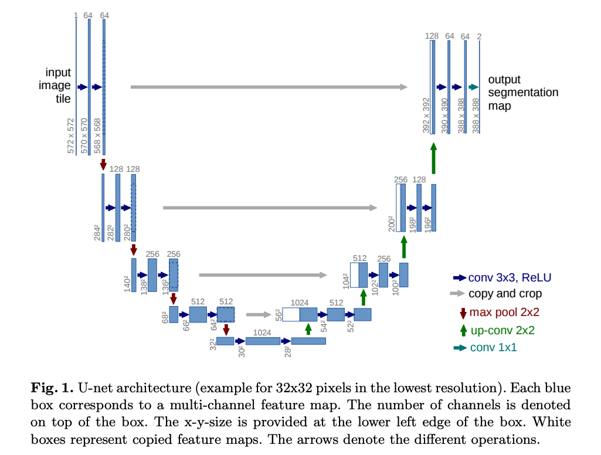
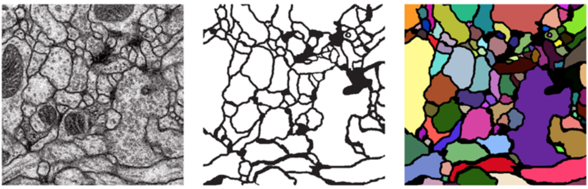
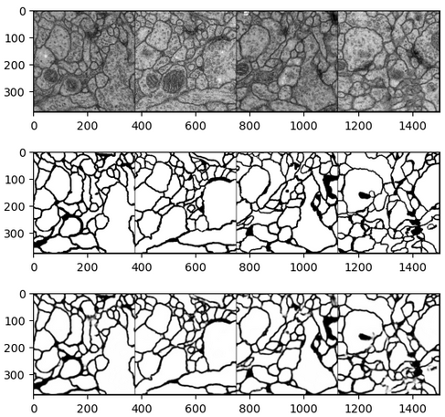

# Biomedical Imaging Segmentation using U-Net

## Overview
This project is focused on performing semantic segmentation of biomedical images using the U-Net architecture. Semantic segmentation is a computer vision task where the goal is to classify each pixel in an image into one of several predefined classes. In biomedical imaging, this technique finds applications in various areas, such as cell nucleus segmentation, tumor detection, and tissue segmentation.

## U-Net Architecture
The U-Net architecture is a popular deep learning model for semantic segmentation tasks. It consists of an encoder and a decoder pathway. The encoder downsamples the input image, while the decoder upsamples the features to produce a segmentation map. Skip connections are used between corresponding layers in the encoder and decoder to preserve spatial information and enable more accurate segmentation.

The figure below is from the paper, [*U-Net: Convolutional Networks for Biomedical Image Segmentation*](https://arxiv.org/abs/1505.04597), by Ronneberger et al. 2015. It shows the U-Net architecture and how it contracts and then expands.

In other words, images are first fed through many convolutional layers which reduce height and width while increasing the channels, which the authors refer to as the "contracting path." For example, a set of two 2 x 2 convolutions with a stride of 2, will take a 1 x 28 x 28 (channels, height, width) grayscale image and result in a 2 x 14 x 14 representation. The "expanding path" does the opposite, gradually growing the image with fewer and fewer channels.

## Dataset
For this project, I used a dataset of electron microscopy
images and segmentation data. The information about the dataset can be found [here](https://www.ini.uzh.ch/~acardona/data.html)! 

> Arganda-Carreras et al. "Crowdsourcing the creation of image
segmentation algorithms for connectomics". Front. Neuroanat. 2015. https://www.frontiersin.org/articles/10.3389/fnana.2015.00142/full

## Model Training
I trained the model for 200 epochs. Following figure shows the result at the end of training. The 3 rows correspond to input image, actual label, and U-Net output(segmented image) respectively.

