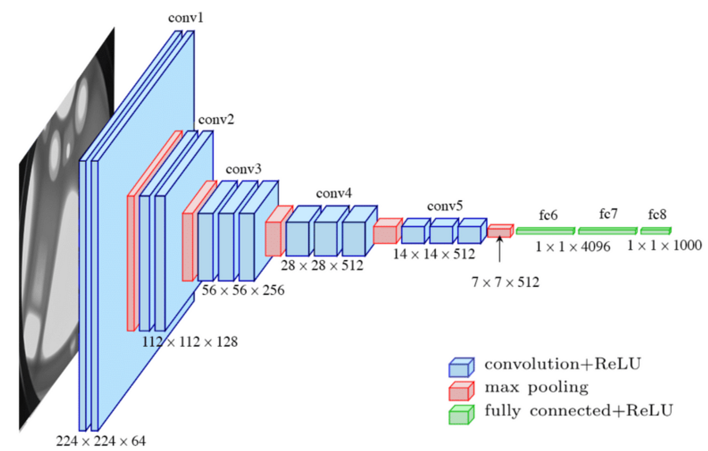

# Face Detector using VGG16 Model

This project demonstrates a face detection system implemented in Python using the VGG16 model. The system is capable of detecting faces in images captured through OpenCV.

## Architecture

The VGG16 model is a deep convolutional neural network that was developed by the Visual Geometry Group (VGG) at the University of Oxford. It consists of 16 convolutional layers, followed by fully connected layers. The architecture diagram above provides an overview of the VGG16 model.

## Dataset

The dataset used for this project was collected from scratch by capturing photos using OpenCV. The dataset consists of various images containing faces in different environments, lighting conditions, and angles. I manually labeled the collected images to indicate the presence and location of face in the images.

## Results

Below is an example output of the face detection system:

In the example image, the face has been successfully detected and marked with bounding boxes.

## Conclusion

This project demonstrates the implementation of a face detection system using the VGG16 model. The system is capable of accurately detecting faces in images and provides a useful tool for various applications, such as face recognition, facial analysis, and more.

