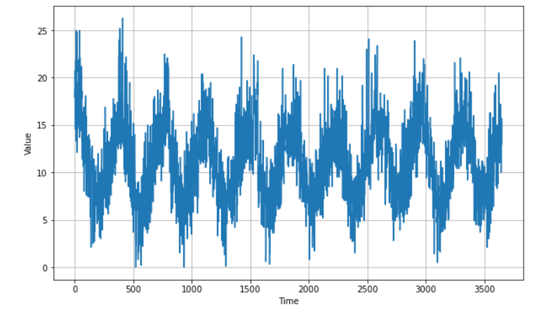
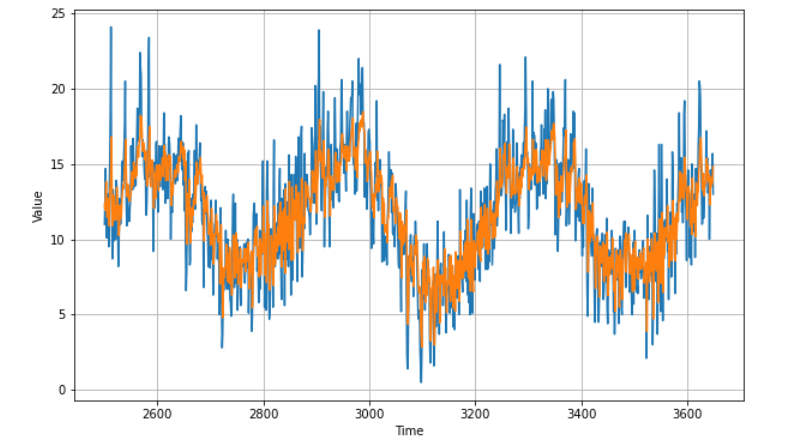

# Temperature Forecaster

This project implements a temperature forecaster using the Daily Minimum Temperatures in Melbourne dataset. The dataset contains daily minimum temperature recordings in Melbourne from 1981 to 1990.

## Dataset

The dataset used for this project is the **Daily Minimum Temperatures in Melbourne** dataset. It consists of historical temperature records in Melbourne, Australia. The dataset is available at [link_to_dataset](https://github.com/jbrownlee/Datasets/blob/master/daily-min-temperatures.csv).

## Data Visualization


## Model Architecture

The model architecture used for temperature forecasting is as follows:

```python
def create_uncompiled_model():
    model = tf.keras.models.Sequential([
        tf.keras.layers.Conv1D(filters=32, kernel_size=5,
                               strides=1, padding="causal",
                               activation='relu',
                               input_shape=[None, 1]),
        tf.keras.layers.LSTM(16, return_sequences=True),
        tf.keras.layers.LSTM(16),
        tf.keras.layers.Dense(12),
        tf.keras.layers.Dense(1),
        tf.keras.layers.Lambda(lambda x: x * 27)
    ])
    return model
```

This architecture consists of a 1D convolutional layer followed by two LSTM layers for sequence modeling. It is then followed by a dense layer with 12 units and a final dense layer with a single unit. The Lambda layer applies a scaling factor to the output, multiplying it by 27.

## Output Result



The forecasted temperatures were evaluated using mean squared error (MSE) and mean absolute error (MAE) metrics. The output values were as follows:
- MSE: 5.25
- MAE: 1.78
